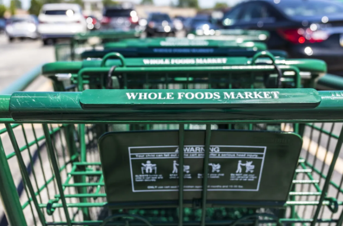

This page is where you can iterate. Follow the lab instructions in the [readme.md](./README.md).

# GROCERY LIST

```
Whole Foods Items
```

### Categories

<table>
  <thead>
    <tr>
      <th>Produce</th>
      <th>Dairy</th>
      <th>Snacks</th>
      <th>Frozen Goods</th>
    </tr>
  </thead>
  <tbody>
    <tr>
      <td>Oranges</td>
      <td>Milk</td>
      <td>Chocolate Pretzels</td>
      <td>Passion Fruit</td>
    </tr>
    <tr>
      <td>Apples</td>
      <td>Eggs</td>
      <td>Chocolate Bar - Hazelnut</td>
      <td>Blueberries</td>
    </tr>
    <tr>
      <td>Kale</td>
      <td>Cheese</td>
      <td></td>
      <td>Strawberries</td>
    </tr>
    <tr>
      <td>Habanero Peppers</td>
      <td></td>
      <td></td>
      <td>Dragon Fruit</td>
    </tr>
  </tbody>
</table>

## Considerations
- Budget - What is available for spending
- Weight of Items to Carry
- Stock of Items at Home



```js
window.alert("Welcome to David's Bi-weekly Grocery Shopping!")
console.log("something")
const replay = view(Inputs.button("Replay"));
```